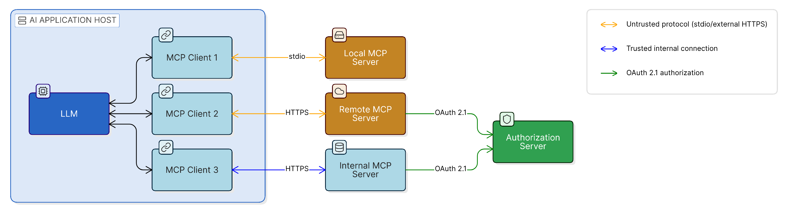

A field guide to running, building, and deploying Model Context Protocol servers without getting burned. Written for security engineers, platform engineers, and anyone whose job description recently grew an "AI agent" bullet point.

This is **Part 1 of a four-post series**. Each post applies the same threat-modeling lens to one cluster of MCP features. Part 1 covers what an MCP server exposes — Tools, Resources, Prompts, and the server-side utilities the 2025-11-25 spec just expanded — and walks the lens through each one so you can run it yourself on whatever the spec adds next.

> **MCP Security series** — Part 1 of 4
>
> 1. **Server features** *(currently reading)*
> 2. Client capabilities — *coming soon*
> 3. Protocol & transport — *coming soon*
> 4. Operating MCP securely — *coming soon*

## What this is / who it's for

If you're using or building MCP servers and you want to reason about what could go wrong, start here. There's no prerequisite MCP background — the post starts with what a server is, what it exposes, and where the trust boundaries land. By the end you'll have applied the same six-step lens to seven distinct server-side features and seen how attacks compose across them.

If you've already read about Tools and Resources elsewhere, the new material is in the second half: tool output schema and the dual error model, the completion utility (one of the quietest data-leak channels in MCP), the server-side logging primitive, and pagination as a cross-tenant attack surface. All of that is in the 2025-11-25 spec; very little of it is in the threat-modeling literature yet.

## Architecture, primitives, and the trust-boundary map

You can't reason about the threat model without a clear picture of what MCP actually exposes. This section is short on purpose — just enough to ground everything that follows.

### Architecture

MCP is a client-server protocol. A **client** runs inside an AI application (a chat app, an IDE, a custom agent). A **server** runs as a separate process — either as a subprocess of the client (stdio transport) or as a remote HTTP service (Streamable HTTP transport). One client typically connects to multiple servers simultaneously, and the LLM driving the client sees the union of capabilities across all of them.

Two architectural facts matter for security:

- **The LLM sees the combined capability surface across all connected servers.** If you have Server A (a poisoned random-fact tool) and Server B (a trusted email tool) connected to the same agent, instructions embedded in Server A's tool descriptions can influence how the LLM uses Server B's tools. There is no namespace isolation enforced by the protocol — that is a property of the client.
- **Transport choice changes the threat model.** stdio servers run as subprocesses with the privileges of the user running the client; the threat model is "untrusted local binary." HTTP servers run on remote infrastructure and require OAuth-style authorization; the threat model is closer to "third-party API."

### The three primitives

MCP servers expose three primitive types. Most blog posts, scanners, and threat models focus on tools — but resources and prompts have their own attack surfaces, and skipping them leaves real gaps.

**Tools** are functions the model can invoke. They have a name, a description, and a JSON schema for their arguments. The LLM decides when to call them based on the conversation. Tools are the most-discussed primitive because they are where the model takes consequential action — and where most of the published attack research lives.

**Resources** are data sources the model can read. Each resource has a URI (`file:///path`, `postgres://...`, custom schemes), a MIME type, and content. Resources are typically attached to a conversation by the user or the application, not invoked autonomously by the model. They can be static or templated, one-shot or subscribed-to-for-changes. Because resources flow as context into the LLM, they are a direct vehicle for indirect prompt injection — and they are often left out of MCP threat models entirely.

**Prompts** are parameterized templates the server exposes for the user to invoke, often surfaced in clients as slash commands or quick actions. A prompt template typically expands into a sequence of messages the LLM will see, sometimes triggering tool calls as part of its expansion. Because prompts execute on the user's behalf with the user's permissions, and because the user usually does not see the full expanded content, they are a high-leverage vehicle for hidden instructions.

The three primitives differ in **who controls invocation**: tools are model-controlled, resources are application-controlled, prompts are user-controlled. That distinction shapes the defenses for each.

### Trust boundaries

A useful mental model is to draw the trust boundaries explicitly. Every interaction between trust zones is a place where a check must happen.

The boundaries that matter:

- **User → Agent**: the only fully trusted input. Everything else flows in derivatively.
- **Agent → stdio server**: a process boundary, but no auth boundary. The server runs as the user.
- **Agent → HTTP server**: a network boundary with OAuth-mediated auth.
- **Server → Upstream API**: a separate auth flow. Tokens at this boundary must not be the same tokens used at the previous boundary — this is the rule that token passthrough violates (covered in Part 3).
- **Retrieved data → Agent context**: not a network boundary, but a *trust* boundary. Content from a resource, a tool result, or an upstream API enters the LLM's reasoning context and must be treated as untrusted input that may carry instructions.

That last boundary is the one most people miss. It is the source of indirect prompt injection.

## Why the LLM reads descriptions and data as instructions

Three things make MCP's threat model different from traditional API security:

1. **The LLM reads tool descriptions, resource contents, and prompt templates as part of its reasoning context.** Anything that lands in that context can influence agent behavior. In traditional API security, descriptions and metadata are inert — they do not steer the caller. In MCP, they do. This is the single most important fact in MCP security and the source of an entire family of attacks (tool poisoning, rug pulls, shadow tools, cross-server injection) that have no clean analogue in REST API security.

2. **One agent connects to many servers, and the agent's effective capability surface is the union of all of them.** Cross-server effects — a description in one server steering tool calls into another — are first-class concerns. There is no namespace isolation enforced by the protocol; that is a property of the client, and not all clients enforce it well.

3. **Production guardrails are still emerging.** MCP itself produces no persistent logs, has no built-in centralized policy plane, and no mandatory provenance signing for tool descriptions. Anything you want — audit logs, allowlists, DLP, alerting — has to come from the client, from a gateway you build or buy, or from your own glue. Most security incidents in MCP today are not novel; they are instances of well-known patterns hitting code paths that have not yet been hardened against them.

The rest of this post organizes around the first observation. Every server-side feature we cover is a place where the LLM reads something — a tool description, a resource body, a prompt template, a completion suggestion, a log line, a paginated cursor's neighbor records — that an attacker would like to control.

## The threat-modeling lens

For each feature in this post — and every feature in Parts 2, 3, and 4 — we walk through the same six steps in the same order. By the third or fourth feature you'll be running the lens yourself; by the end of Part 4 you can apply it to whatever the spec adds next.

1. **What it is.** A one-paragraph definition. No threat content. Just enough to be sure we're talking about the same feature.
2. **How it's intended to work.** Protocol mechanics — JSON-RPC method names, capability declarations, the normal flow. Where useful, a diagram.
3. **Trust boundary crossed.** Which of the boundaries from the previous section the feature operates across. Naming the boundary explicitly anchors the rest of the analysis.
4. **Abuser stories.** Stated as: *"As a malicious **role**, I want to **abuse the feature** so I can **consequence**."* Roles include malicious server, compromised package, malicious tenant, malicious user, network attacker, compromised client, compromised model output. Each abuser story is the inverse of a user story and is what the rest of the section defends against.
5. **Detection signals.** What the feature emits — or fails to emit — when abused. Specific log fields, alert conditions, gateway-side reconciliation patterns. Every signal we name has a corresponding row in Part 4's reference table.
6. **Mitigations.** Layered: spec-level (what the spec MUSTs and SHOULDs), server-side, client-side, gateway-level. Where a mitigation only works at one layer, that's called out. Where the spec's rule is advisory and not actually enforced by the SDK, the gap is named.

Why this lens and not STRIDE or attack trees or the OWASP MCP Top 10? STRIDE is comprehensive but feels academic — "Tampering" doesn't land as concretely as *"as a malicious server, I want to drain your API budget."* Attack trees are useful for one feature in isolation but compose badly across a series. OWASP MCP Top 10 is a list of known risks, not a method for finding new ones. Abuser stories plus trust boundaries plus layered detection-and-mitigation is concrete enough to read end-to-end and structured enough to apply.

We start with the easiest feature to intuit — Tools — and run the full lens on it as a worked example.

## Tools: the lens, walked through

<!-- ~900 words. Full six-step on Tools — poisoning, rug pull, shadow tools, covert invocation, cross-server orchestration injection. Diagrams: tool-poisoning-flow.png, rug-pull-timeline.png, cross-server-injection-flow.png. -->

## Resources

<!-- ~700 words. Six-step lens. Poisoning, indirect prompt injection, path-templated resources, subscription mechanics (resources/subscribe → notifications/resources/updated), annotations as a hidden steering channel (audience/priority). Diagram: resource-poisoning-flow.png. -->

## Prompts

<!-- ~400 words. Six-step lens. Template injection, slash-command hijacking, hidden tool chains. Diagram: prompt-template-injection-flow.png. -->

## Tool output schema and the dual error model

<!-- ~400 words. Six-step lens. outputSchema validation, structuredContent, -32602/-32603 (protocol) vs isError: true (tool execution / LLM self-correction). Abuser angle: poisoned outputSchema misclassifying sensitive data; forged isError steering self-correction. -->

## Completion: argument autocomplete and the quietest data-leak channel

<!-- ~400 words. Six-step lens. completion/complete, ref/prompt and ref/resource, stateful context.arguments. Abuser angle: completion endpoints leak enumerable identifiers without surfacing in tool-call audit logs. Optional diagram: completion-attack-flow.png. -->

## Logging as a server-side primitive

<!-- ~350 words. Six-step lens. logging/setLevel, notifications/message, RFC 5424 levels. Spec mandate: log messages MUST NOT contain credentials, secrets, PII, or internal system details. Abuser angle: misconfigured/compromised server emits secrets via notifications/message; client trusts the server's own redaction. -->

## Pagination as an attack surface

<!-- ~250 words. Six-step lens. Opaque cursors, cross-tenant cursor leakage. Abuser: cursor issued for tenant A replayed against tenant B's session. -->

## Cross-feature attack patterns within server features

<!-- ~300 words. Combinations: cross-server orchestration injection (multi-feature framing), annotation-driven steering combined with subscription-pushed updates, completion + logging exfiltration chains. -->

## Mitigations summary for server features

<!-- ~250 words. Compact reference table or bulleted summary. -->

## Builder checklist

<!-- Short, actionable. Not the omnibus checklist (Post 4). -->

## What's next

<!-- Cross-link to Post 2 (client capabilities), brief teaser. Restate series-nav block. -->

> **MCP Security series** — Part 1 of 4
>
> 1. **Server features** *(currently reading)*
> 2. Client capabilities — *coming soon*
> 3. Protocol & transport — *coming soon*
> 4. Operating MCP securely — *coming soon*
